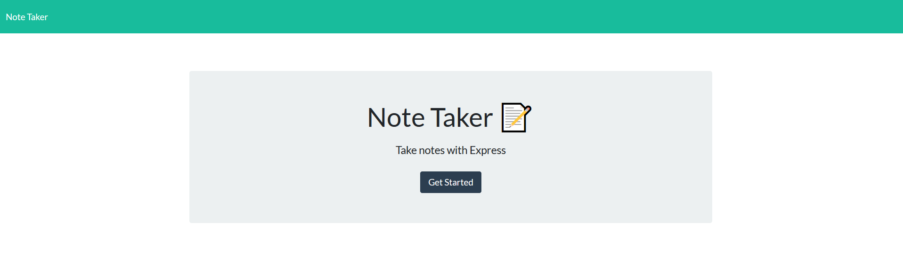

# Note-Taker-Express
## A Node Express web-app for creating, deleting, and saving notes

Deployed site can found [here](https://intense-anchorage-25703.herokuapp.com/)

## Installation:
1. Clone repo to your local machine
2. Run "npm install" in the directory of the cloned repo
4. Run "node server.js" to spawn the web-app at localhost:5000

## This repo contains:
* An Express web server
* localStorage for saving notes
* Notes that all have a unique ID using uniqid
* URL routing 
* Bootstrap CSS 

## Known Issues / Bugs
* None I could find during testing

## What I Learned:
* Understanding the front end while working on the back end makes it way easier to develop, since you know how everythign peices together. Reading the front end code made me start developing much faster.

## Dependencies:
* [Express 4.16.4](https://www.npmjs.com/package/express)
* [Uniqid 5.2.0](https://www.npmjs.com/package/uniqid)

